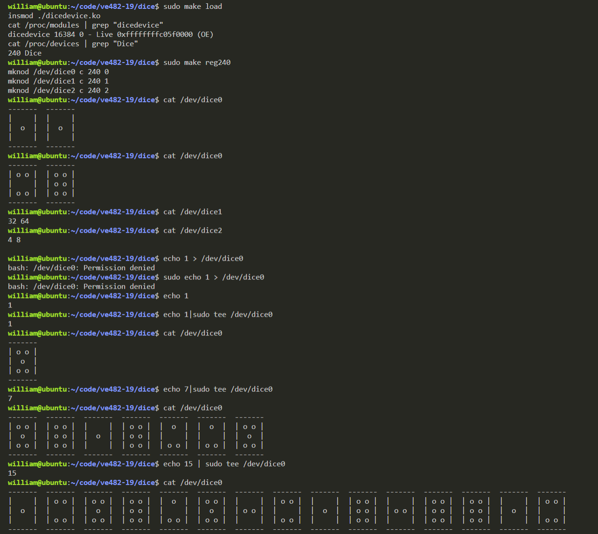
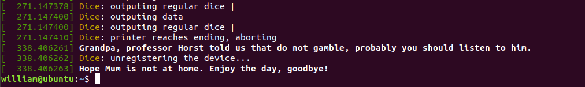

# simple-linux-kernel-module
## Overview
// TODO

Supported features:
1. Printing messages to kernel debug log
2. Registering as a char device driver with dynamic minor numbers
3. Write to user space
4. Read user's input

Demo:

## Future Plan
1. `debugfs` user/kernel interface communication
2. `sysfs` user/kernel interface communication
3. `readdir` manipulation
4. `release` manipulation
5. `fsync` manipulation
6. `lock` manipulation

## Known Issues
1. For larger input number (e.g., 20), the ASCII-dice will not display nicely.
